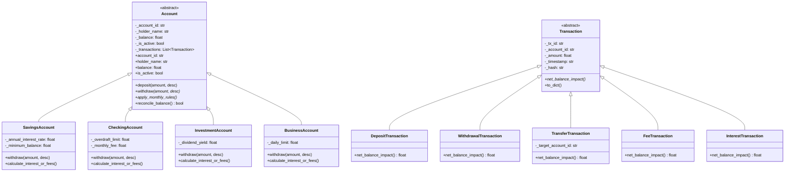

# Task 03: Core Algorithms, OOP Structures & Robust Error Handling


An enterprise-grade Object-Oriented Financial Ledger & Account Management Engine showcasing encapsulation, class inheritance, polymorphism, custom exception hierarchies, and data persistence in JSON and CSV.

---

## 🏛️ System Architecture & Class Hierarchy



---

## 🔑 OOP Principles Demonstrated

1. **Encapsulation**:
   - Internal state (`_balance`, `_transactions`, `_is_active`) is protected.
   - Access and mutations are governed via `@property` getters, setters with validation, and business rule methods.
2. **Inheritance & Abstraction**:
   - Abstract Base Classes `Account` and `Transaction` enforce contracts via `@abstractmethod`.
   - Four distinct account types (`SavingsAccount`, `CheckingAccount`, `InvestmentAccount`, `BusinessAccount`) inherit core ledger features while implementing customized business logic.
3. **Polymorphism**:
   - `withdraw()` applies account-specific constraints (e.g., minimum balance floor in Savings vs. overdraft allowances in Checking vs. daily transaction limits in Business).
   - `apply_monthly_rules()` dynamically credits compounded interest to Savings/Investment accounts while debiting maintenance fees from Checking/Business accounts.
4. **Custom Exception Hierarchy**:
   - `LedgerException` base class with JSON error code serialization.
   - Specific sub-exceptions: `InsufficientFundsError`, `AccountLockedError`, `TransactionLimitExceededError`, `InvalidPayloadError`, `AccountNotFoundError`, `DuplicateAccountError`, and `ReconciliationError`.

---

## ⚡ Core Algorithms

1. **Deterministic Ledger Balance Reconciliation**:
   $$\text{Balance} = \sum_{i=1}^{N} \text{Impact}(T_i)$$
   Verifies ledger integrity by ensuring the current account balance strictly matches the sum of historical net transaction impacts.
2. **Binary Search Timestamp Extraction**:
   Uses `bisect` over chronologically sorted transaction logs to perform $O(\log N + K)$ slice lookups over date ranges.
3. **Tamper-Evident Cryptographic Hashing**:
   Computes a SHA-256 integrity hash for each transaction event:
   $$\text{Hash} = \text{SHA256}(\text{tx\_id} : \text{account\_id} : \text{amount} : \text{timestamp})$$

---

## 💾 Data Persistence (JSON & CSV)

- **JSON Storage (`data/sample_ledger.json`)**: Complete ledger snapshot with account schemas, transaction histories, and ledger summary. Uses atomic write operations via temporary files to avoid partial state corruption.
- **CSV Storage (`data/sample_transactions.csv`)**: Standardized tabular export of all transaction events with cryptographic hashes.

---

## 🧪 Unit Testing & Coverage

```bash
cd 03-core-algorithms-oop-ledger
pytest tests/ -v --cov=ledger_engine --cov-report=term-missing
```

### Test Coverage Highlights
- ✅ 17 comprehensive unit tests with **87%+ code coverage**.
- ✅ Boundary test cases for overdrafts, minimum balances, withdrawal limits, locked accounts, and reconciliation mismatches.
- ✅ Two-way JSON serialization and CSV export/import integrity validation.
