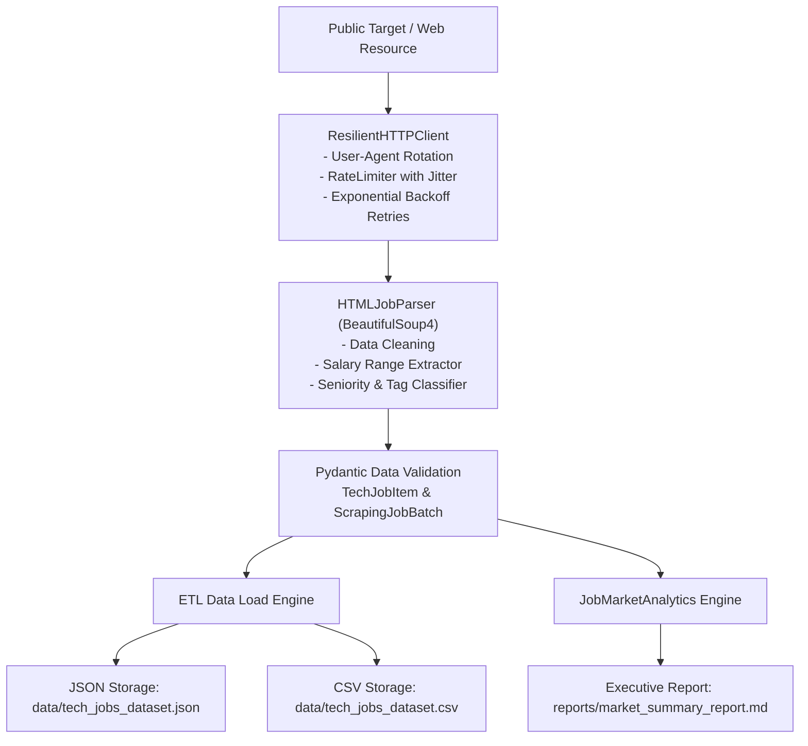

# Task 04: Automated Web Scraping & Data Extraction Pipeline


An automated production-grade ETL Web Scraping & Data Extraction Pipeline built with BeautifulSoup4 and Requests, featuring exponential backoff retries, rate limiting, Pydantic data normalization, CSV/JSON persistence, and automated analytical report generation.

---

## 🏗️ Architecture & Pipeline Flow



---

## 🌟 Scraping Best Practices Implemented

1. **Exponential Backoff Retries**:
   - `urllib3.util.Retry` strategy mounted on `requests.Session` handling `429 (Too Many Requests)`, `500`, `502`, `503`, and `504` server errors.
2. **Polite Rate Limiting & Jitter**:
   - `RateLimiter` ensures safe delays between requests with randomized intervals to avoid anti-bot trigger thresholds.
3. **Browser Header Mimicry**:
   - Dynamic rotation of realistic `User-Agent` strings across modern Chrome, Firefox, Safari, and Edge browsers.
   - Comprehensive request headers including `Accept`, `Accept-Language`, `DNT`, and `Upgrade-Insecure-Requests`.
4. **Schema Validation & Typing**:
   - Strict `Pydantic v2` data modeling ensuring null-safety, numeric normalization, and tag deduplication.

---

## 🚀 Usage & Execution

### 1. Install Dependencies
```bash
pip install -r requirements.txt
pip install -e .
```

### 2. Run the Extraction Pipeline
```bash
# Run standard pipeline (with deterministic test-bench extractor & live fallback)
python -m scraper.pipeline

# Or via installed console script
etl-scrape
```

---

## 📊 Extracted Datasets & Analytical Summary

- **JSON Dataset**: [`data/tech_jobs_dataset.json`](file:///data/tech_jobs_dataset.json)
- **CSV Dataset**: [`data/tech_jobs_dataset.csv`](file:///data/tech_jobs_dataset.csv)
- **Executive Summary Report**: [`reports/market_summary_report.md`](file:///reports/market_summary_report.md)

### Executive Summary Excerpt
```text
Total Job Listings   : 6 validated records
Unique Companies     : 6 hiring organizations
Average Salary (USD) : $169,166.67
Top In-Demand Skills : PYTHON, FASTAPI, DOCKER, KUBERNETES, AWS, SQL
```

---

## 🧪 Unit Testing

```bash
cd 04-automated-web-scraping-pipeline
pytest tests/ -v --cov=scraper --cov-report=term-missing
```
