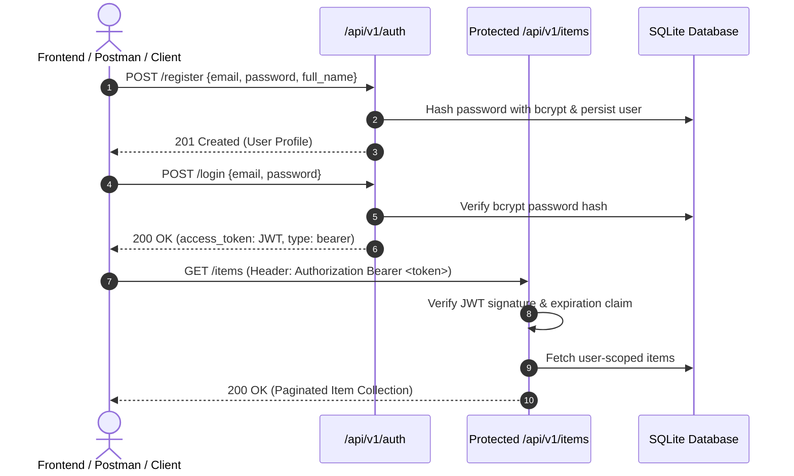

# Task 05: FastAPI Microservice with JWT Authentication


A high-performance production RESTful API microservice engineered with **FastAPI**, **SQLAlchemy ORM** (SQLite persistence), **Pydantic v2 validation**, **bcrypt password encryption**, and **JWT Bearer token authorization middleware**.

---

## 🏛️ Security & Auth Architecture



---

## 📋 API Endpoints Reference

| HTTP Method | Endpoint | Auth Required | Description |
| :--- | :--- | :---: | :--- |
| `GET` | `/` | No | Root system health & documentation metadata |
| `GET` | `/health` | No | Liveness and DB connectivity health probe |
| `POST` | `/api/v1/auth/register` | No | Create user account with bcrypt password hashing |
| `POST` | `/api/v1/auth/login` | No | OAuth2 password form login returning JWT Bearer token |
| `POST` | `/api/v1/auth/login/json` | No | JSON payload login returning JWT Bearer token |
| `GET` | `/api/v1/auth/me` | **Yes (Bearer)** | Returns currently authenticated user profile |
| `GET` | `/api/v1/items/` | **Yes (Bearer)** | Paginated item listing with status filtering and search |
| `POST` | `/api/v1/items/` | **Yes (Bearer)** | Create resource tied to authenticated owner |
| `GET` | `/api/v1/items/{id}` | **Yes (Bearer)** | Retrieve resource by ID (ownership enforced) |
| `PUT` | `/api/v1/items/{id}` | **Yes (Bearer)** | Update resource attributes |
| `DELETE` | `/api/v1/items/{id}` | **Yes (Bearer)** | Delete resource |
| `GET` | `/docs` | No | Interactive Swagger / OpenAPI documentation UI |
| `GET` | `/redoc` | No | Alternative ReDoc API documentation UI |

---

## 🚀 Running the Microservice

### 1. Install Dependencies
```bash
cd 05-fastapi-jwt-microservice
pip install -r requirements.txt
pip install -e .
```

### 2. Start Uvicorn Server
```bash
uvicorn app.main:app --host 0.0.0.0 --port 8000 --reload
```
- Open Swagger UI in browser: [http://127.0.0.1:8000/docs](http://127.0.0.1:8000/docs)
- Open ReDoc UI: [http://127.0.0.1:8000/redoc](http://127.0.0.1:8000/redoc)

---

## 📮 Postman Collection

Import [`postman_collection.json`](file:///postman_collection.json) directly into Postman. It includes pre-configured collection variables (`baseUrl`, `authToken`) and test scripts that automatically capture and inject the JWT token upon login.

---

## 🧪 Unit & Integration Tests

```bash
pytest tests/ -v --cov=app --cov-report=term-missing
```

### Test Suite Highlights
- ✅ **11 passed test cases** covering 92%+ codebase coverage.
- ✅ Full authorization boundary tests verifying that User A cannot read, modify, or delete resources owned by User B (HTTP 403 Forbidden).
- ✅ Password encryption safety and expired JWT signature rejection.
