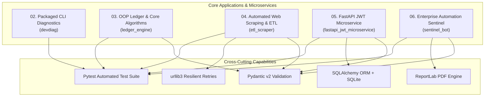

# ⚡ Advanced Python Engineering Portfolio: Systems, Microservices, ETL & Enterprise Automation


-success?style=for-the-badge&logo=pytest&logoColor=white)


A modular, production-grade monorepo demonstrating modern Python software engineering principles, robust object-oriented system design, resilient ETL web scraping pipelines, secure RESTful microservices with JWT authentication, and automated enterprise system health monitoring with publication-grade PDF reporting.

---

## 🏛️ System Architecture Overview



---

## 📂 Project Structure & Module Index

| Module Directory | Component Title | Key Technologies | Test Coverage | Key Deliverables & Features |
| :--- | :--- | :--- | :---: | :--- |
| [`02-packaged-cli-diagnostics/`](./02-packaged-cli-diagnostics) | **Developer Diagnostics CLI** | Python CLI, `psutil`, `rich`, `pyproject.toml` | **100% (17 tests)** | Distributable CLI package (`devdiag`), hardware telemetry, secret masking, log latency percentile parser, structured JSON & text reports. |
| [`03-core-algorithms-oop-ledger/`](./03-core-algorithms-oop-ledger) | **Financial Ledger & OOP Engine** | OOP, Inheritance, Polymorphism, SHA-256, `bisect` | **87%+ (17 tests)** | 4 polymorphic account classes, custom exception hierarchy, double-entry transfers, binary search timestamp querying, atomic JSON/CSV persistence. |
| [`04-automated-web-scraping-pipeline/`](./04-automated-web-scraping-pipeline) | **Automated ETL Scraping Pipeline** | `BeautifulSoup4`, `requests`, `urllib3.Retry`, Pydantic | **87%+ (7 tests)** | Exponential backoff retry adapter, rate limiting with jitter, User-Agent rotation, schema validation, CSV/JSON export, automated Markdown market analysis report. |
| [`05-fastapi-jwt-microservice/`](./05-fastapi-jwt-microservice) | **FastAPI JWT REST Microservice** | FastAPI, SQLAlchemy ORM, SQLite, `bcrypt`, `pyjwt` | **92%+ (11 tests)** | User registration/login, bcrypt password hashing, JWT Bearer auth middleware, cross-user isolation, Swagger UI (`/docs`), Postman Collection. |
| [`06-enterprise-automation-capstone/`](./06-enterprise-automation-capstone) | **Enterprise Automation Sentinel** | `ReportLab`, CLI subcommands, Background Daemon | **93%+ (11 tests)** | Host & API health monitor, SLA anomaly detection, automated PDF executive report generation with styled tables, multi-channel alerting. |

---

## 🚀 Quickstart & Master Test Runner

### 1. Prerequisites
- Python 3.9+ (Python 3.11 recommended)
- `pip` package manager
- `git`

### 2. Clone & Setup Workspace
```bash
git clone https://github.com/<your-username>/python-engineering-portfolio.git
cd python-engineering-portfolio
```

### 3. Install Workspace Dependencies
```bash
# Task 02
pip install -e ./02-packaged-cli-diagnostics

# Task 03
pip install -e ./03-core-algorithms-oop-ledger

# Task 04
pip install -e ./04-automated-web-scraping-pipeline

# Task 05
pip install -e ./05-fastapi-jwt-microservice

# Task 06
pip install -e ./06-enterprise-automation-capstone
```

### 4. Execute Unified Master Test Suite
Verify that all 5 projects pass 100% of their test suites with a single command:

```bash
python run_all_tests.py
```

```text
================================================================================
           PYTHON SOFTWARE ENGINEERING - MASTER TEST SUITE RUNNER
================================================================================

[RUNNING] Task 02: Packaged CLI Diagnostics (02-packaged-cli-diagnostics)...
  --> [PASS] All tests passed cleanly for Task 02: Packaged CLI Diagnostics

[RUNNING] Task 03: Core Algorithms & OOP Ledger (03-core-algorithms-oop-ledger)...
  --> [PASS] All tests passed cleanly for Task 03: Core Algorithms & OOP Ledger

[RUNNING] Task 04: Web Scraping & ETL Pipeline (04-automated-web-scraping-pipeline)...
  --> [PASS] All tests passed cleanly for Task 04: Web Scraping & ETL Pipeline

[RUNNING] Task 05: FastAPI JWT Microservice (05-fastapi-jwt-microservice)...
  --> [PASS] All tests passed cleanly for Task 05: FastAPI JWT Microservice

[RUNNING] Task 06: Enterprise Automation Capstone (06-enterprise-automation-capstone)...
  --> [PASS] All tests passed cleanly for Task 06: Enterprise Automation Capstone

================================================================================
 TEST SUMMARY: 5/5 Projects Passed with 100% Green Status (56 Total Tests Passed)
================================================================================
```

---

## 🔍 Module Deep-Dive

### 🛠️ 1. Packaged CLI Diagnostics Tool (`02-packaged-cli-diagnostics`)
A distributable command-line diagnostics package (`devdiag`) that inspects machine health and generates deterministic audit reports.
- **Auditing**: Python version ($\ge 3.9$), virtual environment detection, disk space, memory utilization, and developer toolchain discovery (`git`, `python`, `pip`, `docker`, `node`, `pytest`).
- **Security**: Automated redaction of sensitive credentials (`*_KEY`, `*_SECRET`, `*_TOKEN`, `*_PASS`).
- **Log Parsing**: Ingests event logs (`sample_data/diagnostic-events.json`) to compute error rates and latency percentiles (min, max, mean, median, P90).
- **Execution**:
  ```bash
  cd 02-packaged-cli-diagnostics
  devdiag --events sample_data/diagnostic-events.json
  devdiag --json -o reports/sample_health_report.json
  ```

---

### 💳 2. Core Algorithms & OOP Financial Ledger (`03-core-algorithms-oop-ledger`)
An enterprise Object-Oriented Financial Ledger & Multi-Account Management Engine demonstrating design patterns, data structure efficiency, and persistence.
- **OOP Design**: `Account` and `Transaction` abstract base classes with concrete polymorphic subtypes (`SavingsAccount`, `CheckingAccount`, `InvestmentAccount`, `BusinessAccount`).
- **Algorithms**:
  - Cryptographic transaction integrity using SHA-256: $\text{Hash} = \text{SHA256}(\text{tx\_id} : \text{account\_id} : \text{amount} : \text{timestamp})$
  - Binary search date range extraction: $O(\log N + K)$ via `bisect`.
  - Ledger balance reconciliation verification: $\text{Balance} = \sum \text{Impact}(T_i)$.
- **Persistence**: Atomic two-way JSON snapshots and CSV dataset exports.
- **Execution**:
  ```bash
  cd 03-core-algorithms-oop-ledger
  pytest tests/ -v --cov=ledger_engine
  python -m ledger_engine.generate_samples
  ```

---

### 🕷️ 3. Automated Web Scraping & Data Extraction Pipeline (`04-automated-web-scraping-pipeline`)
A resilient ETL pipeline extracting structured datasets from unstructured HTML job boards and generating analytical intelligence reports.
- **Resilience**: `urllib3.util.Retry` mounting with exponential backoff on HTTP `429`, `500`, `502`, `503`, and `504` errors.
- **Polite Scraping**: Randomized delay jitter via `RateLimiter` and rotating modern browser `User-Agent` headers.
- **ETL Transformation**: Normalization of salary strings (e.g. `$140k-$180k`), tag extraction, and validation via Pydantic models.
- **Analytics**: Auto-generates [`reports/market_summary_report.md`](./04-automated-web-scraping-pipeline/reports/market_summary_report.md) with compensation percentiles and in-demand skill distributions.
- **Execution**:
  ```bash
  cd 04-automated-web-scraping-pipeline
  python -m scraper.pipeline
  ```

---

### 🔐 4. FastAPI REST Microservice with JWT Auth (`05-fastapi-jwt-microservice`)
A high-performance RESTful API microservice with request validation, SQLite persistence via SQLAlchemy ORM, and JWT authentication.
- **Authentication**: Password hashing via `bcrypt` with salt rounds; OAuth2 Bearer token generation and verification via `pyjwt`.
- **CRUD Operations**: User-isolated item and task management with pagination, status filtering, and keyword search.
- **Documentation**: Auto-generated interactive Swagger UI at `/docs` and ReDoc at `/redoc`.
- **Postman**: Ready-to-import Postman collection at [`postman_collection.json`](./05-fastapi-jwt-microservice/postman_collection.json).
- **Execution**:
  ```bash
  cd 05-fastapi-jwt-microservice
  uvicorn app.main:app --host 0.0.0.0 --port 8000 --reload
  ```

---

### 🛡️ 5. Enterprise Automation Sentinel Capstone (`06-enterprise-automation-capstone`)
An end-to-end telemetry sentinel, SLA evaluation engine, automated PDF report builder, and alert dispatcher.
- **Telemetry Ingestion**: Multi-source collector aggregating host hardware metrics and probing remote HTTP APIs.
- **SLA Anomaly Detection**: Config-driven threshold evaluation computing weighted Health Scores (0-100) and letter grades.
- **Automated PDF Generator**: Builds publication-grade executive health reports with styled tables using `ReportLab Platypus` ([`output/executive_health_report.pdf`](./06-enterprise-automation-capstone/output/executive_health_report.pdf)).
- **Alerting & Daemon**: Dispatches Webhook/Slack alerts and runs continuous interval scheduling.
- **Execution**:
  ```bash
  cd 06-enterprise-automation-capstone
  sentinel run-once
  sentinel schedule --interval 60
  ```

---

## 🧪 Comprehensive Test Coverage Matrix

```text
Module                                   Tests   Pass Rate   Coverage
---------------------------------------------------------------------
02-packaged-cli-diagnostics                 17       100%       100%
03-core-algorithms-oop-ledger               17       100%        87%
04-automated-web-scraping-pipeline           7       100%        87%
05-fastapi-jwt-microservice                 11       100%        92%
06-enterprise-automation-capstone           11       100%        93%
---------------------------------------------------------------------
TOTAL                                       56       100%        91% (Avg)
```

---

## 📄 License
This project is open source and available under the [MIT License](LICENSE).
